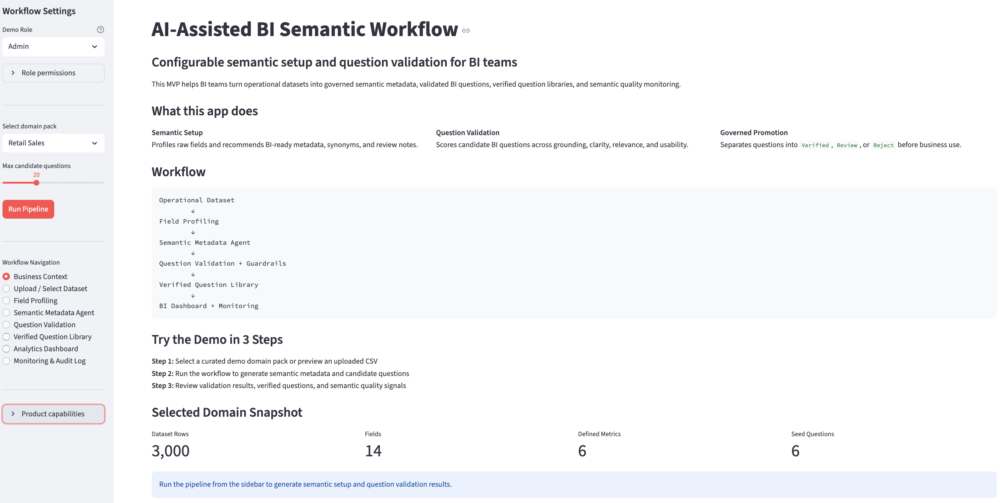
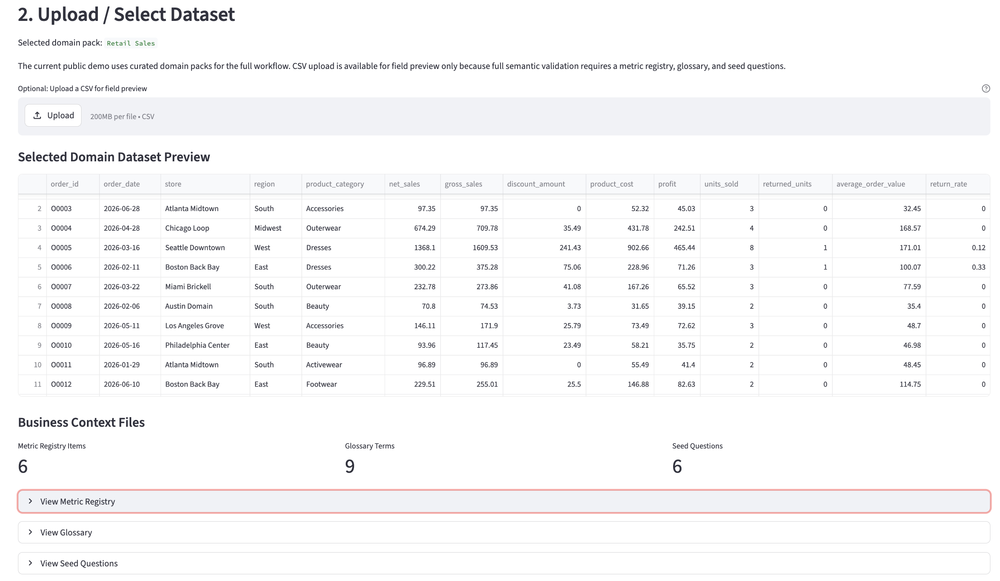
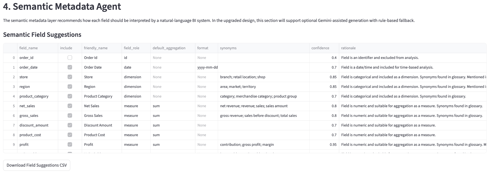
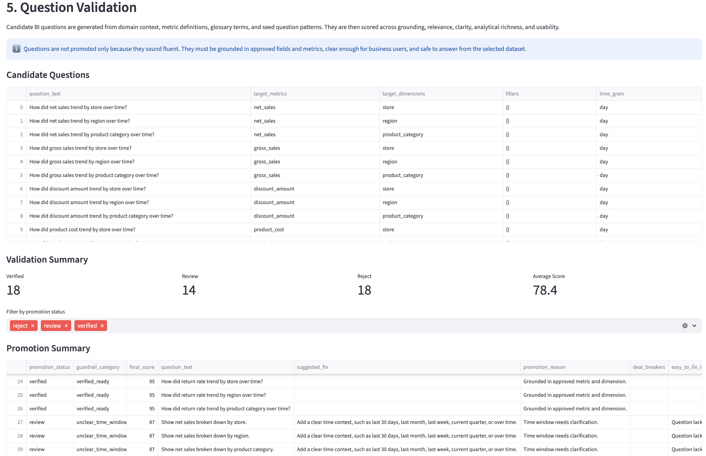
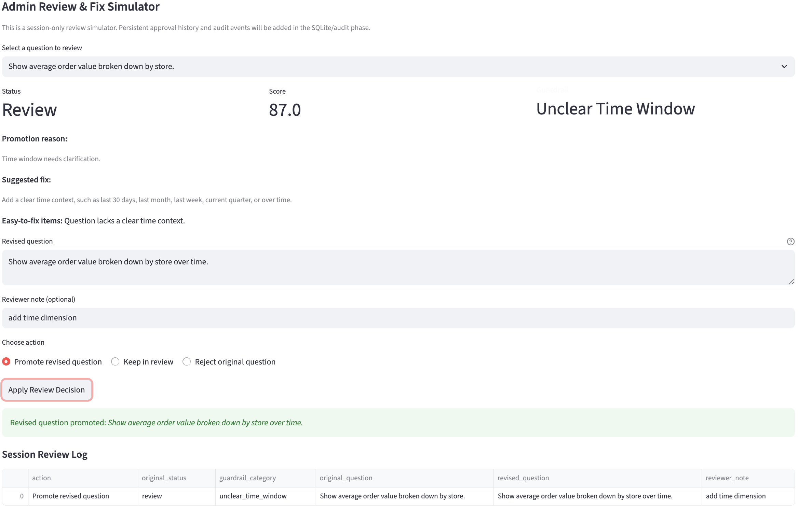
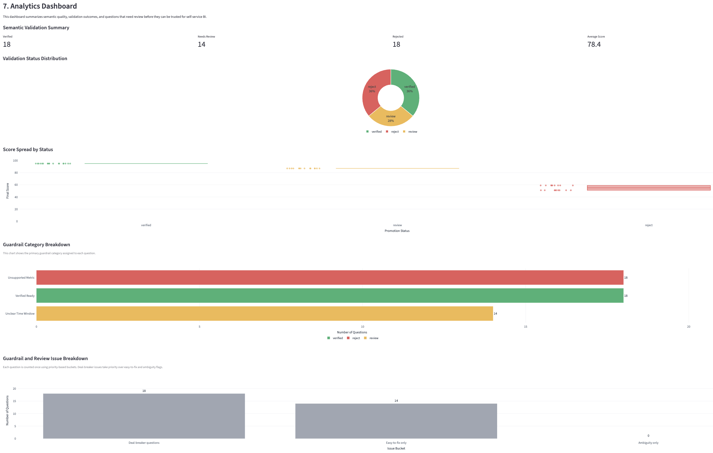
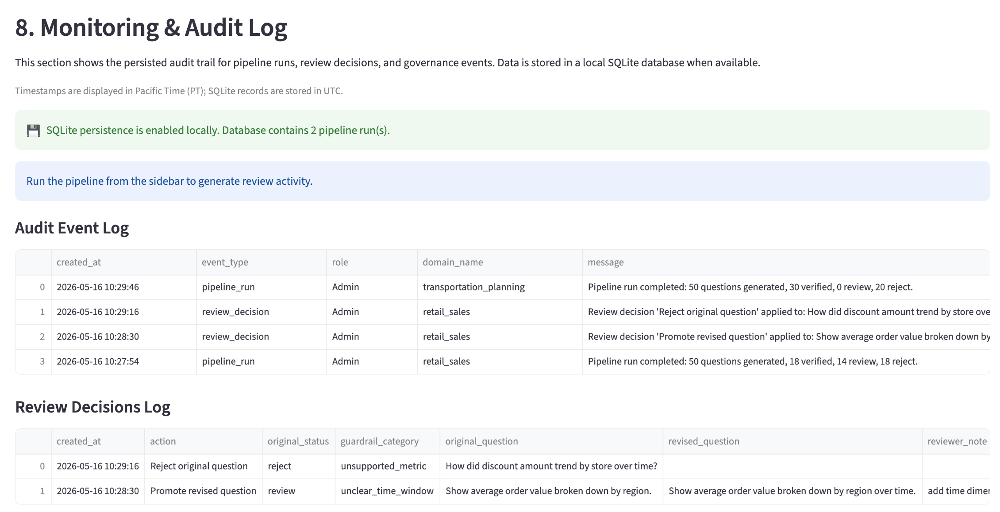

# AI-Assisted Semantic BI Workflow

A product-style Streamlit app for building governed BI semantic layers, validating natural-language BI questions, and promoting trusted self-service analytics assets.

This project is designed as an end-to-end **AI-assisted BI workflow system**. It helps BI teams move from raw operational datasets and business definitions to semantic metadata, candidate questions, validation decisions, verified question libraries, dashboard-ready outputs, and audit monitoring.

## Live Demo

**[Try the Streamlit MVP here](https://semantic-bi-workflow.streamlit.app/)**

---

## Product Overview

Natural-language BI tools are only as reliable as the semantic layer behind them. If field definitions, synonyms, aggregation rules, and verified question patterns are incomplete or inconsistent, business users may receive answers that look correct but are hard to trust.

**AI-Assisted Semantic BI Workflow** demonstrates how BI teams can operationalize the setup, validation, and governance layer behind natural-language analytics.

The app has a complete workflow with:

1. Configurable business domain packs
2. Dataset profiling and semantic setup suggestions
3. Optional LLM-assisted metadata generation
4. Rule-based fallback for stable public demo behavior
5. Candidate BI question generation
6. Validation guardrails and promotion scoring
7. Role-based review workflow
8. Verified question library
9. SQLite-backed persistence for generated outputs
10. BI readiness dashboard
11. Monitoring, audit log, and human feedback loop

Instead of treating GenAI as a black-box answer engine, this product focuses on the operating layer that makes AI-powered BI trustworthy: metric definitions, business terminology, grounding checks, scoring logic, role-based review, and auditability.

---

## Product Snapshot

This app is designed as a lightweight operating layer for semantic BI setup. It helps BI owners answer practical questions such as:

1. Which fields should be exposed to natural-language BI?
2. What business definitions, synonyms, and review notes should each field have?
3. Which generated questions are actually grounded in the available dataset and approved metrics?
4. Which questions should be verified, reviewed, or rejected before reaching business users?
5. Who should be allowed to generate, approve, or promote trusted BI questions?
6. How ready is this dataset for reliable self-service analytics?

Current domain packs include:

- Retail Sales
- Supply Chain
- Workforce Operations
- Transportation Planning

This config-driven structure makes the workflow reusable across multiple business contexts instead of being tied to one dashboard or one dataset.

---

## Product Preview

The app is organized as a product-style workflow. It guides users from domain selection and dataset inspection to semantic metadata generation, question validation, human-in-the-loop review, dashboard monitoring, and SQLite-backed audit history.

### 1. Workflow Overview



The homepage introduces the end-to-end BI semantic workflow, including domain context, semantic setup, question validation, verified library, dashboard monitoring, and audit history.

### 2. Dataset Selection



Users can choose a business domain pack and inspect the uploaded or sample dataset before running the semantic workflow pipeline.

### 3. Semantic Metadata Agent



The semantic metadata agent recommends how each field should be interpreted by a natural-language BI system, with rule-based generation by default and optional Gemini-assisted enrichment.

### 4. Question Validation



Candidate BI questions are scored and classified into verified, review, or reject outcomes with guardrail categories, concise promotion reasons, and suggested fixes.

### 5. Admin Review & Fix Simulator



Admins can review flagged questions, revise question wording, simulate review decisions, and capture session-level review logs before persistent audit storage.

### 6. Analytics Dashboard



The dashboard summarizes validation outcomes, guardrail category distribution, issue buckets, and historical pipeline runs for workflow monitoring.

### 7. Audit Log



SQLite-backed audit logs persist pipeline runs and review decisions, making the workflow easier to trace and review across sessions.

---

## Background

This product was inspired by my experience building **Amazon Q Topics in QuickSight** when I was a BIE intern at Amazon.

While adding a **natural-language Q&A** feature to a dashboard was relatively straightforward, making the AI understand business context required a lot of manual setup. I had to define field synonyms, clarify metric meanings, collect frequently asked questions, and verify whether those questions were actually grounded in the dashboard logic.

This product turns that pain point into a reusable workflow app pattern: **a configurable semantic BI system where BI teams can select a domain, inspect fields, generate semantic setup suggestions, validate candidate questions, and decide what is safe to promote into a trusted question library.**

---

## Business Problem

**Natural-language BI tools are only as reliable as their semantic layer.**

Business users often ask questions using informal terms, incomplete context, or different wording from the actual dataset. Without strong semantic setup, the BI assistant may misunderstand the question, use the wrong metric, or generate answers that are not aligned with the official business definition.

The main pain points this product addresses are:

- Manual effort in setting up field names, synonyms, metric definitions, and verified questions
- Risk of AI using unofficial or incorrect metric logic
- Lack of structured validation before promoting natural-language questions
- Limited visibility into which questions are trusted, under review, or rejected
- Lack of role-based review controls for BI owners, developers, and business users
- Low trust when users cannot tell whether AI-generated outputs are grounded in approved BI context

---

## Solution

Semantic BI Workflow turns **raw BI context** into **reviewable semantic assets.**

The workflow takes in:

- Sample dataset
- Metric registry
- Business glossary
- Seed questions

It then runs an end-to-end workflow:

- Profiles dataset fields and identifies likely dates, dimensions, measures, identifiers, and excluded fields
- Generates semantic setup suggestions such as friendly names, synonyms, include/exclude decisions, and review notes
- Optionally uses a Gemini-powered LLM service to enrich semantic metadata generation
- Falls back to deterministic rule-based logic when no API key is configured
- Creates candidate BI questions from approved metrics, dimensions, time grains, and seed-question patterns
- Scores each question across grounding, relevance, clarity, analytical richness, and usability
- Applies deal-breaker guardrails to prevent unsupported or ungrounded questions from being promoted
- Supports role-based review so Admins, BI Developers, and Business Viewers have different permissions
- Promotes trusted questions into a verified question library
- Stores generated metadata, validation results, verified questions, and review actions in SQLite
- Surfaces semantic readiness, validation status, and audit activity through dashboard and monitoring views

The app is not designed to replace BI owners. It is designed to help them move faster by turning repetitive semantic setup work into a structured, governed, and auditable workflow.

---

## Workflow Architecture

```text
Frontend UI
   ↓
Domain Pack Selection
   ↓
Sample Dataset / Uploaded Operational Dataset
   ↓
Field Profiling Pipeline
   ↓
Semantic Metadata Agent
   ↓
Optional Gemini API Integration
   ↓
Rule-Based Fallback + Pydantic Validation
   ↓
Candidate Question Generator
   ↓
Validation + Guardrails
   ↓
Role-Based Review
   ↓
Verified Question Library
   ↓
SQLite Output Tables
   ↓
BI Readiness Dashboard
   ↓
Monitoring + Audit + Feedback Loop
```

---

## Key Features

### Configurable Domain Packs

The app supports multiple business domains through lightweight domain packs. Each domain pack includes a sample dataset, glossary, metric registry, and seed questions.

This makes the workflow reusable across different BI contexts. A BI team can add a new domain without rewriting the core app logic.

Current examples include:

- Retail sales analytics
- Supply chain operations
- Workforce operations
- Transportation planning

### Field Profiling

The pipeline profiles each column using:

- Null rate
- Distinct count
- Sample values
- Data type
- Heuristic field role

Example field roles include:

- Date
- Dimension
- Measure
- Identifier
- Excluded field

This helps identify which fields are useful for natural-language BI and which fields should not be exposed directly to business users.

### Semantic Metadata Agent

The system suggests BI-ready metadata for each field, including:

- Include or exclude decision
- Friendly field name
- Field role
- Synonyms
- Review notes

For example, a field like `employee_id` may be excluded from user-facing Q&A, while a field like `net_sales` may be included with synonyms such as `revenue`, `sales`, and `sales amount`.

### Optional Gemini API Integration

The upgraded design includes optional Google Gemini API integration for LLM-assisted semantic metadata generation.

The LLM service is designed with:

- Streamlit secrets for API key management
- Pydantic schemas for structured output validation
- Domain-pack context as grounding input
- Rule-based fallback when no API key is available
- Error handling so the public demo does not break if the API call fails

This allows the app to demonstrate LLM-assisted semantic setup while still remaining stable and reproducible for a public portfolio demo.

### Rule-Based Fallback

The app does not depend entirely on live LLM calls.

If the Gemini API key is missing, invalid, or unavailable, the workflow falls back to deterministic rule-based generation. This keeps the app usable for BI users who open the public demo without authentication or secrets configured.

### Candidate BI Question Generation

The workflow generates candidate BI questions based on:

- Approved metrics
- Dimensions
- Filters
- Time grains
- Domain-pack seed questions

Example:

```text
Question: What is monthly net sales by region?

Target metric: net_sales
Target dimension: region
Time grain: month
Decision: Candidate for validation
```

This simulates the manual verified-question setup process used in natural-language BI tools, but makes it faster and easier to review.

### Question Validation and Promotion Decision

The question validation design was inspired by the modularized evaluation framework proposed by Ao, Singh, and Antinome (2026) in *Optimizing Prompt Refinement: Algorithmic Strategies for Large Language Model-based Text Classification*. The paper proposes breaking a complex classification task into separate evaluation categories, scoring each category independently, and then combining the scores with rule-based thresholds and deal-breaker logic for a final decision.

In this product, I adapted that modularized approach from exam-question quality classification to BI question validation. Instead of evaluating exam questions by accuracy, clarity, complexity, format, and relevancy, this workflow evaluates candidate BI questions across five BI-focused dimensions:

| Dimension | Purpose |
|---|---|
| Grounding | Checks whether the question is supported by available fields and approved metrics |
| Relevance | Checks whether the question fits the business context |
| Clarity | Checks whether the question is specific and understandable |
| Analytical Richness | Checks whether the question supports meaningful analysis |
| Usability | Checks whether a business user would likely ask or use this question |

The scores are combined with threshold-based logic to produce one of three promotion decisions:

| Decision | Meaning |
|---|---|
| Verified | Ready to promote as a trusted BI question |
| Review | Potentially useful, but needs human review or revision |
| Reject | Not grounded, irrelevant, unclear, or not suitable for the dashboard |

To make the validation more governance-aware, I also added deal-breaker rules. If a generated question references an unsupported metric, uses a missing field, or does not match the business context, it can be rejected even if some individual scores look acceptable.

This helps prevent polished but ungrounded questions from being promoted as trusted BI questions. The workflow also provides review reasons and suggested fixes so BI owners can quickly improve weaker questions.

### Verified Question Library

Approved questions can be promoted into a verified question library.

The verified library is designed to show:

- Question text
- Promotion status
- Validation scores
- Guardrail notes
- Review reasons
- Domain context

This creates a trusted layer of natural-language BI questions that business users can rely on.

### Role-Based Review Workflow

The upgraded app includes a public demo role simulator and optional authentication hooks.

Planned roles:

| Role | Upload Data | Generate Metadata | Manage Verified Questions | View Dashboard |
|---|---:|---:|---:|---:|
| Admin | ✅ | ✅ | ✅ | ✅ |
| BI Developer | ✅ | ✅ | View only | ✅ |
| Business Viewer | ❌ | ❌ | View only | ✅ |

For the public demo, the app uses a role simulator so reviewers can see how different users experience the workflow without needing to log in.

For future authenticated deployments, the app is designed to support Streamlit OIDC and simple role mapping.

### SQLite Persistence

The upgraded design includes local SQLite persistence for workflow outputs.

Planned tables include:

- `semantic_metadata`
- `question_validation_results`
- `verified_questions`
- `audit_log`

This turns the app from a stateless prototype into a more complete review workflow where generated outputs, promotion decisions, and human actions can be stored and inspected.

### BI Readiness Dashboard

The BI readiness dashboard is designed to help BI teams understand whether a dataset and its semantic layer are ready for reliable natural-language analytics.

Planned dashboard metrics include:

- Semantic coverage rate
- Approved question rate
- Average ambiguity risk
- Fields missing business definitions
- Questions rejected by guardrails
- Verified questions promoted
- LLM-assisted generations count
- Rule-based generations count

Planned charts include:

- Question validation status distribution
- Average score by validation dimension
- Verified questions by domain
- High-risk questions requiring review

### Monitoring + Audit + Feedback Loop

The monitoring and audit layer is designed to track human-in-the-loop review actions.

Planned audit events include:

- Metadata generation
- Question approval
- Question rejection
- Question promotion
- Review feedback notes
- Role-based user actions

This helps make the semantic workflow more transparent, reviewable, and governance-aware.

---

## Technical Approach

### Modular Streamlit App

The app is organized as an interactive Streamlit workflow rather than a one-off notebook. Users can select a domain pack, inspect source data, generate semantic setup suggestions, review candidate questions, validate promotion decisions, and inspect future dashboard signals in one place.

### Domain-Pack Driven Configuration

Business context is stored outside the Python logic through domain folders. This keeps the workflow extensible: new business domains can be added by providing a dataset, glossary, metric registry, and seed questions.

### Pydantic-Based Structured Pipeline

Pydantic schemas define structured inputs and outputs for field profiles, semantic suggestions, candidate questions, and scoring results. This makes the workflow easier to validate, debug, and extend to LLM-based generation.

### Optional LLM Layer with Safe Fallback

The upgraded architecture adds Gemini API integration as an optional enhancement. LLM-generated outputs are validated against Pydantic schemas before they can be used by the app. If the LLM response is missing, invalid, or unavailable, deterministic rule-based generation remains available.

### Governance-Aware Scoring

Candidate questions are scored across grounding, relevance, clarity, analytical richness, and usability. Deal-breaker rules prevent missing-field questions, unsupported metrics, or weakly grounded questions from being promoted.

### Role-Aware Review Design

The app separates the responsibilities of business viewers, BI developers, and admins. This reflects a more realistic BI operating model where not every user should be able to approve or promote trusted analytics assets.

### Persistence and Auditability

The upgraded design introduces SQLite-backed storage for semantic metadata, validation results, verified questions, and audit log events. This supports dashboard monitoring, review traceability, and future feedback loops.

---

## Tech Stack

| Area | Tools |
|---|---|
| App Interface | Streamlit |
| Core Logic | Python |
| Data Processing | Pandas |
| Schema Validation | Pydantic |
| Configuration Layer | YAML domain packs |
| Domain Inputs | CSV sample datasets, metric registries, glossaries, seed questions |
| Optional LLM Layer | Google Gemini API |
| Secrets Management | Streamlit secrets |
| Access Control Design | Role simulator, optional Streamlit OIDC |
| Persistence | SQLite |
| Dashboarding | Streamlit charts / Plotly-ready design |
| AI-Assisted Development | GitHub Copilot, Claude, Kiro |
| BI Inspiration | Amazon QuickSight Q Topics |

---

## What This Product Demonstrates

This product demonstrates how to design a BI product workflow that connects **business context, semantic modeling, AI-assisted generation, validation logic, role-based governance, dashboard monitoring, and auditability.**

It highlights:

- Translating a real BI pain point into a reusable app workflow
- Designing config-driven semantic layers across multiple business domains
- Building structured validation logic for natural-language BI questions
- Applying LLMs carefully with grounding, schemas, fallback logic, and human review
- Thinking beyond dashboards into trust, governance, role-based workflows, and monitoring
- Creating a product-style analytics tool rather than a one-off analysis script

---

### Reference

Ao, Z., Singh, J., & Antinome, S. (2026). *[Optimizing Prompt Refinement: Algorithmic Strategies for Large Language Model-based Text Classification](https://www.ijcaonline.org/archives/volume187/number78/optimizing-prompt-refinement-algorithmic-strategies-for-large-language-model-based-text-classification/).* International Journal of Computer Applications, 187(78).
