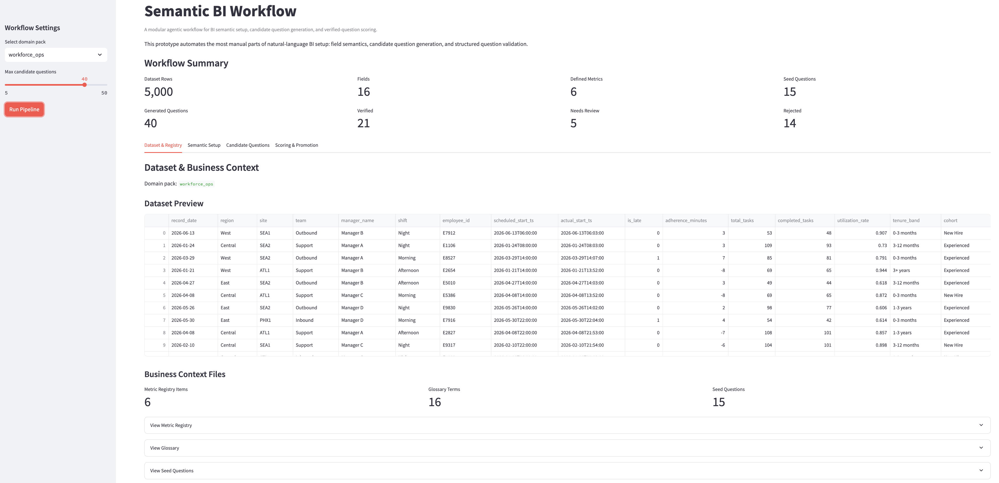
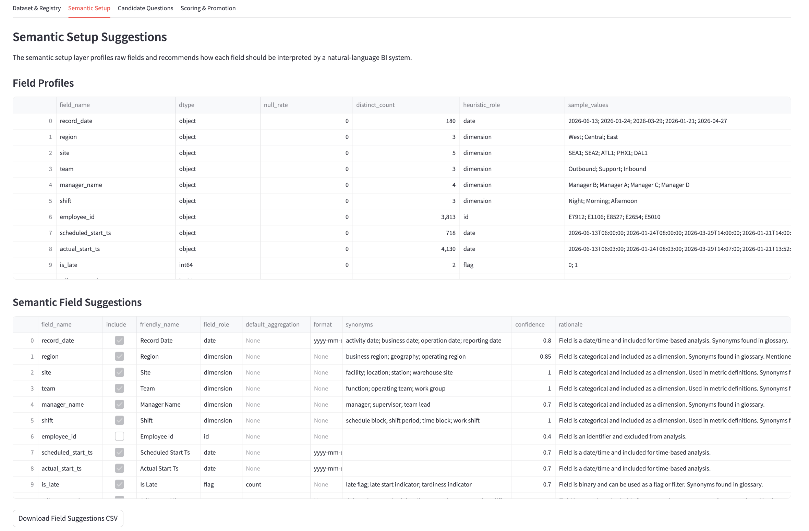
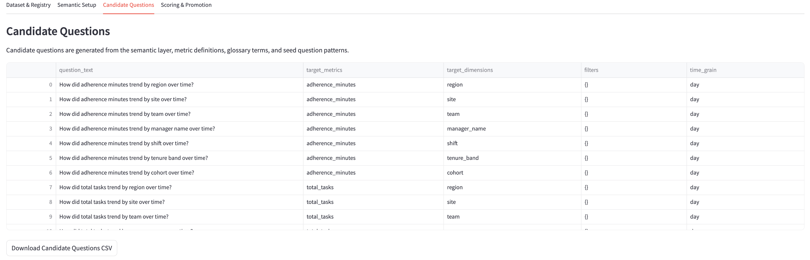
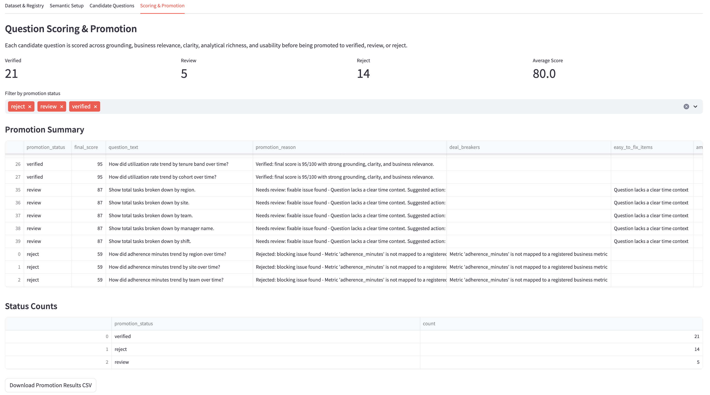

# AI-Assited Semantic BI Workflow

AI-Assited Semantic BI Workflow is a **GenAI-powered BI prototype** that helps automate semantic setup, candidate verified-question generation, and question quality validation in **natural-language analytics** for better **self-service BI.**

## Live Demo

**[Try the Streamlit MVP here](STREAMLIT_APP_LINK_HERE)**

---

## Project Preview

### Streamlit MVP



### Semantic Setup and Question Validation



### Candidate Verified Questions



### Promotion Decision



---

## Background

This project was inspired by my experience building **Amazon Q Topics in QuickSight** when I was a BIE intern at Amazon.

While adding a **natural-language Q&A** feature to a dashboard was relatively straightforward, making the AI understand business context required a lot of manual setup. I had to define field synonyms, clarify metric meanings, collect frequently asked questions, and verify whether those questions were actually grounded in the dashboard logic.

This project explores how an **AI-assisted workflow** can reduce that manual work while still keeping **BI governance, metric definitions, and human review in the loop.**

---

## Business Problem

**Natural-language BI tools are only as reliable as their semantic layer.**

Business users often ask questions using informal terms, incomplete context, or different wording from the actual dataset. Without strong semantic setup, the BI assistant may misunderstand the question, use the wrong metric, or generate answers that are not aligned with the official business definition.

The main pain points this project addresses are:

- Manual effort in setting up field names, synonyms, and verified questions
- Risk of AI using unofficial or incorrect metric logic
- Lack of structured validation before promoting natural-language questions
- Low trust when business users cannot tell whether AI-generated answers are grounded in approved BI context

---

## Solution

Semantic BI Workflow turns **raw BI context** into **reviewable semantic assets.**

The workflow takes in:

- a sample dataset
- a metric registry
- a business glossary
- seed questions

Then it generates:

- field profiles
- semantic setup suggestions
- candidate verified questions
- question quality scores
- final promotion decisions: `Verified`, `Review`, or `Reject`

The goal is not to replace BI owners. The goal is to help BI owners move faster by automating repetitive setup work while preserving metric governance and review control.

---

## Workflow

```text
Sample Dataset
      +
Metric Registry
      +
Glossary
      +
Seed Questions
      ↓
Field Profiling
      ↓
Semantic Setup Suggestions
      ↓
Candidate Verified Questions
      ↓
Question Validation Scoring
      ↓
Promotion Decision
      ↓
Verified / Review / Reject
```

---

## Key Features

### Field Profiling

The pipeline profiles each column using:

- Null rate
- Distinct count
- Sample values
- Data type
- Heuristic field role

Example field roles include:

- Date
- Dimension
- Measure
- Identifier
- Excluded field

This helps identify which fields are useful for natural-language BI and which fields should not be exposed directly to business users.

### Semantic Setup Suggestions

The system suggests BI-ready metadata for each field, including:

- Include or exclude decision
- Friendly field name
- Field role
- Synonyms
- Review notes

For example, a field like `employee_id` may be excluded from user-facing Q&A, while a field like `net_sales` may be included with synonyms such as `revenue`, `sales`, and `sales amount`.

### Candidate Verified Questions

The workflow generates candidate BI questions based on:

- Approved metrics
- Dimensions
- Filters
- Time grains

Example:

```text
Question: What is monthly net sales by region?

Target metric: net_sales
Target dimension: region
Time grain: month
Decision: Candidate for validation
```

This simulates the manual verified-question setup process used in natural-language BI tools, but makes it faster and easier to review.

### Question Validation and Promotion Decision

The question validation design was inspired by the modularized evaluation framework proposed by Ao, Singh, and Antinome (2026) in *Optimizing Prompt Refinement: Algorithmic Strategies for Large Language Model-based Text Classification*. The paper proposes breaking a complex classification task into separate evaluation categories, scoring each category independently, and then combining the scores with rule-based thresholds and deal-breaker logic for a final decision.

In this project, I adapted that modularized approach from exam-question quality classification to BI question validation. Instead of evaluating exam questions by accuracy, clarity, complexity, format, and relevancy, this workflow evaluates candidate BI questions across five BI-focused dimensions:

| Dimension | Purpose |
|---|---|
| Grounding | Checks whether the question is supported by available fields and approved metrics |
| Relevance | Checks whether the question fits the business context |
| Clarity | Checks whether the question is specific and understandable |
| Analytical Richness | Checks whether the question supports meaningful analysis |
| Usability | Checks whether a business user would likely ask or use this question |

The scores are combined with threshold-based logic to produce one of three promotion decisions:

| Decision | Meaning |
|---|---|
| Verified | Ready to promote as a trusted BI question |
| Review | Potentially useful, but needs human review or revision |
| Reject | Not grounded, irrelevant, unclear, or not suitable for the dashboard |

To make the validation more governance-aware, I also added deal-breaker rules. If a generated question references an unsupported metric, uses a missing field, or does not match the business context, it can be rejected even if some individual scores look acceptable.

This helps prevent polished but ungrounded questions from being promoted as trusted BI questions. The workflow also provides review reasons and suggested fixes so BI owners can quickly improve weaker questions.

---

## Technical Approach

### Pydantic-Based Heuristic Agent

The current MVP uses a Pydantic-based heuristic agent.

Pydantic schemas define structured inputs and outputs, which makes the pipeline more stable, easier to validate, and easier to extend. The current version uses rule-based logic instead of live LLM calls, so the workflow is transparent and easier to debug.

This design also prepares the project for future LLM integration because model outputs can be constrained by predefined schemas.

### YAML Metric Registry and Glossary

YAML files store business context outside the Python code.

The metric registry acts as the source of truth for official metric definitions. The glossary provides business terms and synonyms. This config-driven design makes the workflow easier to maintain, review, and scale.

Example:

```yaml
metrics:
  - name: net_sales
    definition: Gross sales minus discounts and returns
    business_owner: BI Team
```

---

## Tech Stack

| Area | Tools |
|---|---|
| Prototype App | Streamlit |
| Core Logic | Python |
| Data Processing | Pandas |
| Schema Validation | Pydantic |
| Configuration | YAML |
| AI-Assisted Development | GitHub Copilot, Claude |
| Future AI Direction | LLM API integration, RAG |
| BI Inspiration | Amazon QuickSight Q Topics |

---

## Future Improvements

Planned improvements include:

- Integrate LLM APIs for richer synonym and question generation
- Add RAG over metric registry, glossary, dashboard documentation, and FAQ examples
- Export semantic setup suggestions into BI-tool-ready formats
- Add human-in-the-loop review for semantic suggestions and question promotion
- Improve scoring calibration using real user questions
- Deploy the Streamlit MVP publicly

---

## What This Project Demonstrates

**This project demonstrates how GenAI can enhance self-service BI by turning business context, semantic layers, and governance logic into a more scalable and trustworthy analytics workflow.**

It combines:

- BI semantic layer design
- Metric governance
- Natural-language analytics
- Structured validation
- Config-driven pipeline design
- AI-assisted workflow automation

---

### Reference

Ao, Z., Singh, J., & Antinome, S. (2026). *[Optimizing Prompt Refinement: Algorithmic Strategies for Large Language Model-based Text Classification](https://www.ijcaonline.org/archives/volume187/number78/optimizing-prompt-refinement-algorithmic-strategies-for-large-language-model-based-text-classification/).* International Journal of Computer Applications, 187(78).
